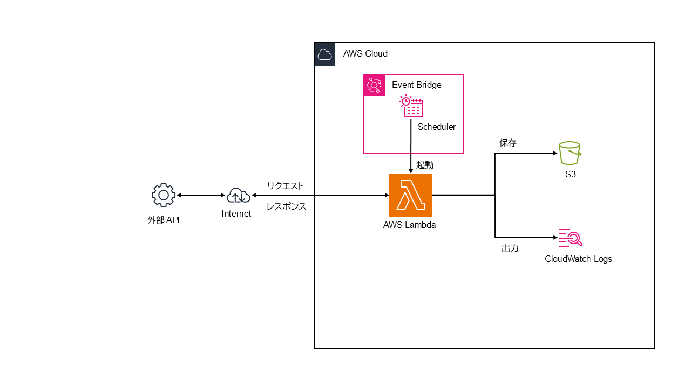

# Exchange Rate Fetcher 為替レート取得ツール

## 概要
外部 API から為替レートを取得し、Amazon S3 へアップロードする自動化ツール<br>
- **サーバーレス運用**: AWS Lambda と EventBridge スケジューラによる定期実行<br>
- **データ永続化**: 取得データを JSON 形式で、Amazon S3 に蓄積<br>

## システム構成
- **トリガー**: EventBridge スケジューラ（cron形式による定期実行）
- **実行環境**: AWS Lambda（API連携・データ加工処理）
- **外部 API**: <a href="https://frankfurter.dev/">Frankfurter API</a>（為替レートの提供）
- **保存先**:   Amazon S3 バケット（JSON形式）



## 使用技術
- **言語**: Python 3.11
- **ライブラリ**: requests
- **インフラ**: AWS (Lambda、EventBridge、S3)

## 機能
- **データ取得**: 外部 API から最新の為替レートを取得
- **データ処理**: 取得データを JSON 形式へ変換（/tmp ディレクトリ配下に一時保存）
- **データ保存**: Amazon S3 バケットにアップロード

## 実行方法
### 開発環境
- **OS**: Windows 11 + WSL2 (Ubuntu)
- **環境構成**: VS Code の Dev Container
- **認証**: aws sso login により認証済みであること

### ローカル実行
プロジェクトルートにて以下のコマンドを実行します。
```bash
python main.py
```

### 実行ログ例
.env ファイルから環境変数の値を読み込み、API 取得、一時保存、S3 アップロード、一時ファイル削除までの一連のフローが実行されます。

```plaintext
vscode ➜ /workspaces/exchange_rate_fetcher (main) $ python main.py
2026-01-22 15:00:34,617 INFO main 為替レート取得完了
2026-01-22 15:00:34,622 INFO main JSONファイル保存完了 path=/tmp/exchange_rates/exchange_2026-01-22T06-00-34Z.json
2026-01-22 15:00:34,717 INFO botocore.tokens Loading cached SSO token for takaken94-sso
2026-01-22 15:00:35,089 INFO botocore.tokens SSO Token refresh succeeded
2026-01-22 15:00:35,821 INFO main S3アップロード完了 s3://takaken94-exchange-rate-fetcher/rates-data/exchange_2026-01-22T06-00-34Z.json
2026-01-22 15:00:35,821 INFO main 一時ファイル削除完了 path=/tmp/exchange_rates/exchange_2026-01-22T06-00-34Z.json
2026-01-22 15:00:35,823 INFO main 為替レート取得結果（基準日:2026-01-21）
2026-01-22 15:00:35,823 INFO main USD_JPY: 157.79 円
2026-01-22 15:00:35,823 INFO main EUR_JPY: 185.23 円
...
```

### テスト
pytest を使用して、正常系、異常系（APIエラーなど）のテストを行います。

```bash
pytest -v
```

### テスト結果
```plaintext
================================================================================ test session starts
collected 5 items                                                                             

tests/test_error.py::test_get_exchange_rate_api_error PASSED                               [ 20%]
tests/test_error.py::test_run_fail_error PASSED                                            [ 40%]
tests/test_normal.py::test_run_logic_jpy_injection PASSED                                  [ 60%]
tests/test_normal.py::test_default_target_currencies_used PASSED                           [ 80%]
tests/test_normal.py::test_cross_rate_calculation PASSED                                   [100%]

================================================================================= 5 passed in 0.28s
```

## 運用
本プロジェクトは、 AWS インフラにて定期実行されています。<br>
以下は、 AWS マネジメントコンソールで確認した稼働状況です。

### 処理ログ（Amazon CloudWatch Logs）
EventBridge スケジューラによって起動された Lambda 関数（exchange-rate-fetcher）の実行ログです。<br>


### ストレージ（Amazon S3 バケット）
取得した為替レートは、以下のバケットへ JSON ファイルとして蓄積します。<br>
- バケット名: takaken94-exchange-rate-fetcher
- 保存パス: /rates-data/


### 保存ファイルの内容（サンプル）
exchange_2026-01-22T23-00-13Z.json<br>
```json
{
  "date": "2026-01-22",
  "base": "USD",
  "rates": {
    "AUD": 1.4691,
    "CAD": 1.3814,
    "EUR": 0.85426,
    "GBP": 0.74509,
    "JPY": 158.79
  },
  "fetched_at": "2026-01-22T23:00:13.341418+00:00"
}
```
