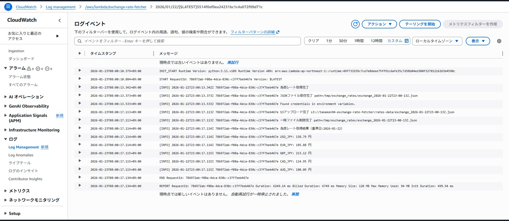
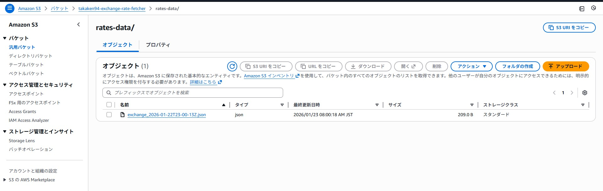

# Exchange Rate Fetcher

## 概要
外部 API から為替レートを取得し、AWS S3 へアップロードする自動化ツールです。<br>
- サーバーレス運用: AWS Lambda / EventBridge スケジューラを利用した自動実行します。<br>
- データ永続化: 取得した為替レートを JSON ファイル形式で S3 に蓄積します。<br>

## システム構成

EventBridge スケジューラ (cron)<br>
--> Lambda 関数 <-> 外部 API<br>
--> S3 バケット<br>

## 使用技術
- Python 3.11
- requests ライブラリ
- AWS (Lambda, EventBridge, S3)

## 機能
- 外部 API から為替レート取得
- JSON ファイル形式で一時保存
- S3 にアップロード

## 実行方法
### 開発環境
Windows 11 + WSL2 (Ubuntu) + Dev Container を想定。<br>
前提条件: aws sso login で認証済みであること。

```bash
python main.py
```

```plaintext
vscode ➜ /workspaces/exchange_rate_fetcher (main) $ python main.py
2026-01-22 15:00:32,509 INFO main .env ファイルから環境変数の値を読み込みました。
2026-01-22 15:00:34,617 INFO main 為替レート取得完了
2026-01-22 15:00:34,622 INFO main JSONファイル保存完了 path=/tmp/exchange_rates/exchange_2026-01-22T06-00-34Z.json
2026-01-22 15:00:34,717 INFO botocore.tokens Loading cached SSO token for takaken94-sso
2026-01-22 15:00:35,089 INFO botocore.tokens SSO Token refresh succeeded
2026-01-22 15:00:35,821 INFO main S3アップロード完了 s3://takaken94-exchange-rate-fetcher/rates-data/exchange_2026-01-22T06-00-34Z.json
2026-01-22 15:00:35,821 INFO main 一時ファイル削除完了 path=/tmp/exchange_rates/exchange_2026-01-22T06-00-34Z.json
2026-01-22 15:00:35,823 INFO main 為替レート取得結果（基準日:2026-01-21）
2026-01-22 15:00:35,823 INFO main USD_JPY: 157.79 円
2026-01-22 15:00:35,823 INFO main EUR_JPY: 185.23 円
2026-01-22 15:00:35,823 INFO main GBP_JPY: 211.84 円
2026-01-22 15:00:35,823 INFO main CAD_JPY: 114.40 円
2026-01-22 15:00:35,823 INFO main AUD_JPY: 106.82 円
```

### テスト
```bash
pytest -v
```

```plaintext
vscode ➜ /workspaces/exchange_rate_fetcher (main) $ pytest -v
================================================================================ test session starts
platform linux -- Python 3.11.14, pytest-9.0.2, pluggy-1.6.0 -- /usr/local/bin/python3.11
cachedir: .pytest_cache
rootdir: /workspaces/exchange_rate_fetcher
collected 5 items                                                                             

tests/test_error.py::test_get_exchange_rate_api_error PASSED                               [ 20%]
tests/test_error.py::test_run_fail_error PASSED                                            [ 40%]
tests/test_normal.py::test_run_logic_jpy_injection PASSED                                  [ 60%]
tests/test_normal.py::test_default_target_currencies_used PASSED                           [ 80%]
tests/test_normal.py::test_cross_rate_calculation PASSED                                   [100%]

================================================================================= 5 passed in 0.28s
```
## AWS での稼働実績
本プロジェクトは AWS 上で定期実行されています。

### CloudWatch Logs
Lambda 関数 exchange-rate-fetcher が EventBridge スケジューラによって起動され、為替レートを取得しているログです。


### S3 バケット
アップロードした JSON ファイルが日付ごとに蓄積されている様子です。


## ファイルサンプル
ファイル名: exchange_2026-01-22T06-00-34Z.json<br>
```json
{
  "date": "2026-01-21",
  "base": "USD",
  "rates": {
    "AUD": 1.4771,
    "CAD": 1.3793,
    "EUR": 0.85186,
    "GBP": 0.74487,
    "JPY": 157.79
  },
  "fetched_at": "2026-01-22T06:00:34.616351+00:00"
}
```
